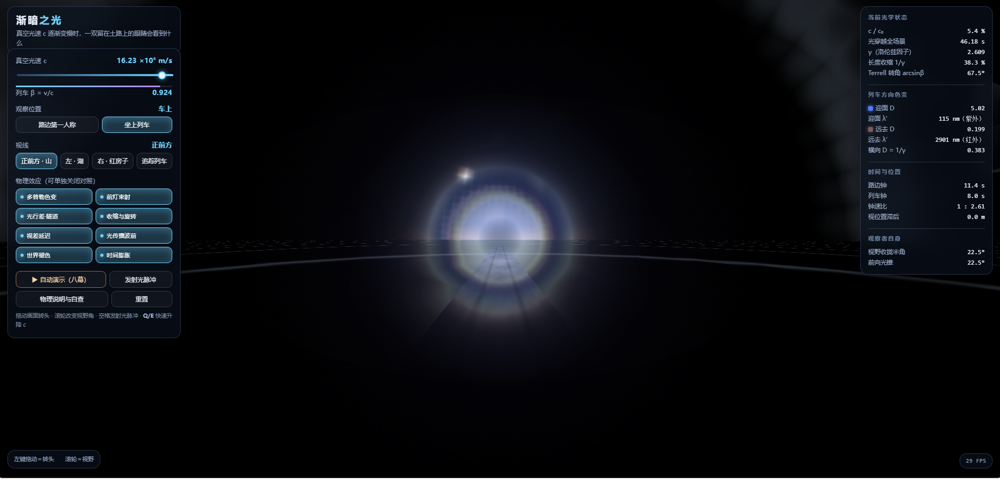
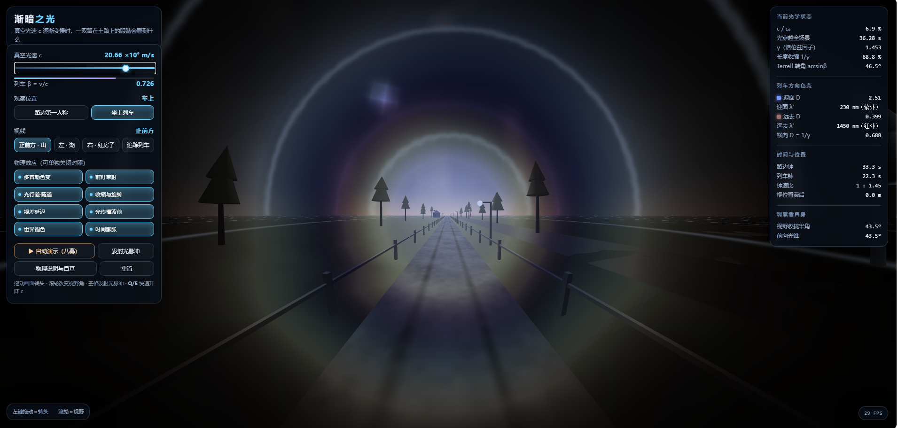
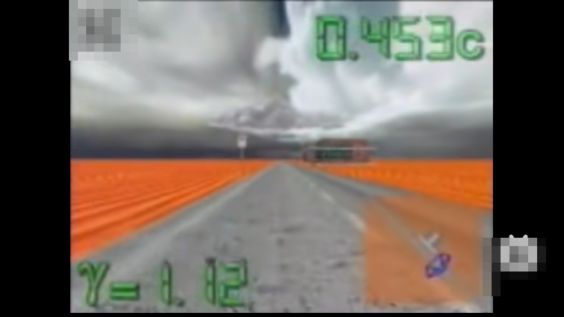
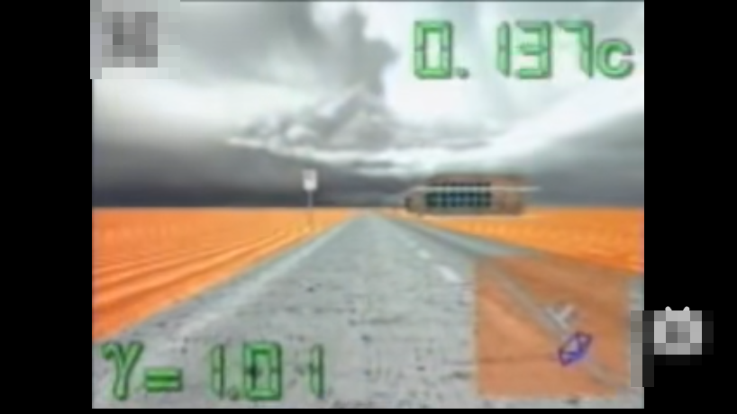
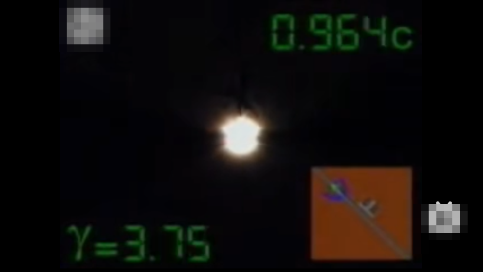
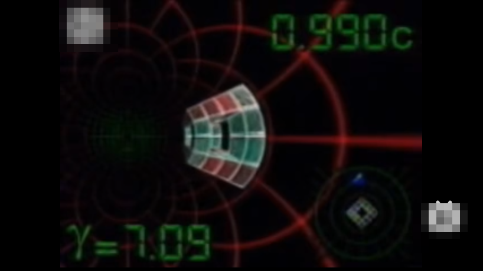

# 渐暗之光 Dimming Light

**用前沿科学研究作为测试用例，是评测多模态大模型更好的方式。**

## 为什么

通用测试题（写个 TODO、画个按钮）只能考"会不会写代码"，考不出模型**到底懂不懂自己在写什么**。

而前沿科学中的可视化问题天然是一份**可自动验证的综合性考卷**：

| 考察维度 | 前沿科学测试用例怎么考 |
|---|---|
| 科学理解 | 物理方向有唯一正确答案（多普勒前蓝后红、运动钟变慢、隧道视觉只在运动视角出现），写反了就是错，不依赖主观判断 |
| 代码实现 | 要交付可运行的实时渲染程序，公式对了实现错了照样露馅 |
| 视觉推理 | 多模态模型被要求"画出人眼看到的世界"，输出本身就是图像，效果一眼可验 |
| 防背诵 | 思想实验没有现成答案可抄，模型必须真的推一遍 |

本仓库是一个完整样例：用狭义相对论的**视觉效应**（不是公式推导）作为测试用例，考察多模态大模型的科学理解与 3D 代码实现。

## 测试用例：《渐暗之光》

思想实验：**如果真空光速逐渐变慢，人眼看到的世界会发生什么变化？**

（现实锚点：Gamow《物理世界奇遇记》里光速只有几十 km/h 的小镇；MIT Game Lab《A Slower Speed of Light》。）

要求 AI 交付一个自包含 HTML 3D 动画，场景为第一人称土路、左湖、右红房子、远山、一辆发光列车，需呈现：

1. **光速变慢本身**——波前传播肉眼可见变慢，远方影像滞后
2. **多普勒色变**——前蓝紫、后红、侧向红移变暗，沿方向连续变化而非整体刷色
3. **束射（前灯效应）**——前方更亮成光锥，速度越快越窄越亮
4. **光行差（隧道视觉）**——运动视角下视野向正前方收拢，侧面景物拉伸变形
5. **长度收缩与外观旋转**——运动物体看起来是转过角度而非压扁
6. **视差延迟**——看到的位置拖在实际位置后面
7. **整体视觉趋势**——世界褪色变暗去饱和，最终只剩前方窄而亮的蓝紫光斑

完整提示词见 [`prompt/渐暗之光-测试提示词.txt`](prompt/渐暗之光-测试提示词.txt)。提示词只说"做什么"，不说"怎么做"——实现方式全部留给被测模型。

## AI 交付物

[`dimming-light-3d.html`](dimming-light-3d.html) —— 单文件自包含（内联 Three.js），浏览器打开即运行。拖动"真空光速 c"滑块即可看到世界从正常逐步走向隧道化的全过程，支持路边/车上双视角与八幕自动演示。

### 项目截图（多模态模型的一次性交付效果）

| 车上视角 β=0.924：隧道视觉收拢，前方蓝白亮斑 | 车上视角 β=0.726：光行差彩虹环，路面景物被扫向前方 |
|---|---|
|  |  |

### 参考可视化对照

以下为经典科普可视化中的同类画面（仅作参照，视频地址略）：

| 公路第一人称场景（0.45c） | 世界褪色变暗（0.14c） |
|---|---|
|  |  |

| 束射亮斑·周围黑暗（0.96c，γ=3.75） | Terrell 旋转 + 多普勒色场（0.99c，γ=7.09） |
|---|---|
|  |  |

AI 交付的画面与参照在**物理方向**上逐项吻合：隧道视觉半角 ≈ 1/γ、前方蓝白亮斑、世界去饱和变暗、运动物体外观旋转而非压扁。

## 结论

前沿科学测试用例把"科学对不对、代码跑不跑、画面像不像"压缩成一次可复现的交付。这类题目比通用编程题更能分辨多模态大模型的真实能力边界——**懂物理的和背代码的，一跑就看出来。**

## 目录

```
├── dimming-light-3d.html        # AI 交付物：自包含 3D 动画（直接双击打开）
├── prompt/
│   └── 渐暗之光-测试提示词.txt    # 一次性下发的测试提示词本体
└── screenshots/                 # 项目截图与参考可视化截图
```
